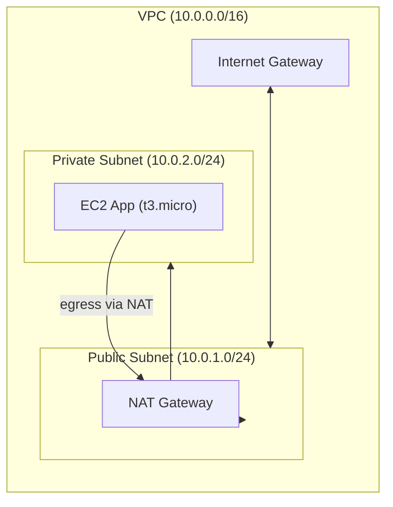

# Terraform AWS Infrastructure (Showcase)

[](https://github.com/SandeepKancharla-04/AWS_Terraform_Infra/actions/workflows/terraform-plan.yml)

Provision a production-shaped VPC with public/private subnets, NAT, and a private EC2 app node. CI runs fmt/validate/tflint/plan on PRs; manual apply on main.

## Quick start (local)
```bash
cp terraform.tfvars.example terraform.tfvars
terraform init
terraform plan
```

## Architecture



## Demo

### CI Plan Check Passing


### Sample Terraform Plan Output
```bash
$ terraform plan
Refreshing Terraform state in-memory prior to plan...
The refreshed state will be used to calculate this plan, but will not be
persisted to local or remote state storage.

Terraform will perform the following actions:

  # aws_instance.app will be created
  + resource "aws_instance" "app" {
      + ami                          = "ami-1234567890abcdef0"
      + instance_type               = "t3.micro"
      + subnet_id                   = (known after apply)
      + vpc_security_group_ids      = (known after apply)
      + associate_public_ip_address = false
      + tags                        = {
          + "Name" = "aws-infra-demo-app"
      }
  }

  # aws_security_group.app will be created
  + resource "aws_security_group" "app" {
      + name        = "aws-infra-demo-app-sg"
      + description = "Private app SG"
      + vpc_id      = (known after apply)
  }

Plan: 2 to add, 0 to change, 0 to destroy.
```

## What I Learned

- **CI/CD Security**: How to configure Terraform to run safely in CI without real AWS credentials
- **Provider Configuration**: Using `skip_credentials_validation` and mock credentials to prevent IMDS access
- **Workflow Design**: Creating GitHub Actions that validate infrastructure code without deploying
- **Module Structure**: Organizing Terraform code into reusable modules with proper variable handling
- **Security Best Practices**: Implementing least-privilege access and preventing accidental deployments

## Production apply (manual)
- Local only:
  ```bash
  terraform init
  terraform plan -out=tfplan
  terraform apply tfplan
  ```

## Profiles/Cost-safe mode
⚠️ **Cost protection enabled**: NAT Gateway resources are temporarily commented out to prevent surprise costs during development/testing. This means private subnets won't have internet access.

To enable full production networking (with internet access for private subnets):
1. Uncomment NAT resources in `modules/vpc/main.tf`
2. Uncomment private route table and associations
3. Note: NAT Gateway incurs hourly charges (~$45/month)

## Contributing

### Branch Protection Setup
To ensure code quality and prevent direct pushes to main:

1. Go to **Repository Settings → Branches**
2. Click **Add rule** for `main` branch
3. Configure:
   - ✅ **Require a pull request before merging**
   - ✅ **Require status checks to pass before merging** → Select `terraform-plan`
   - ✅ **Dismiss stale approvals when new commits are pushed** (recommended)
4. Click **Create**

### Development Workflow
1. Create feature branch: `git checkout -b feature/your-change`
2. Make changes and test locally:
   ```bash
   terraform fmt -recursive
   terraform validate
   terraform plan
   ```
3. Commit and push: `git push origin feature/your-change`
4. Create Pull Request → CI will run `terraform-plan` workflow
5. Ensure all checks pass before merging
6. Merge only after approval and CI success

### Code Standards
- Run `terraform fmt` before committing
- Follow existing module structure
- Test changes with `terraform plan` locally
- Update documentation for significant changes
