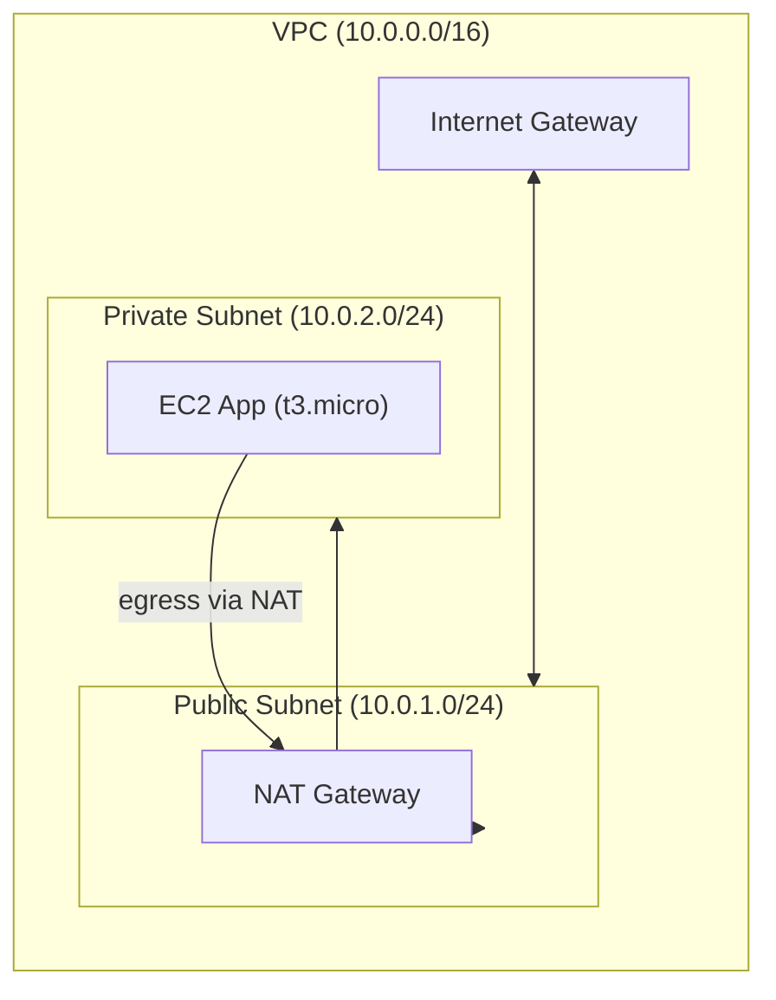

# Terraform AWS Infrastructure (Showcase)

[](https://github.com/OWNER/REPO/actions/workflows/terraform-plan.yml)

Provision a production-shaped VPC with public/private subnets, NAT, and a private EC2 app node. CI runs fmt/validate/tflint/plan on PRs; manual apply on main.

## Quick start (local)
```bash
cp terraform.tfvars.example terraform.tfvars
terraform init
terraform plan
```

## Architecture


